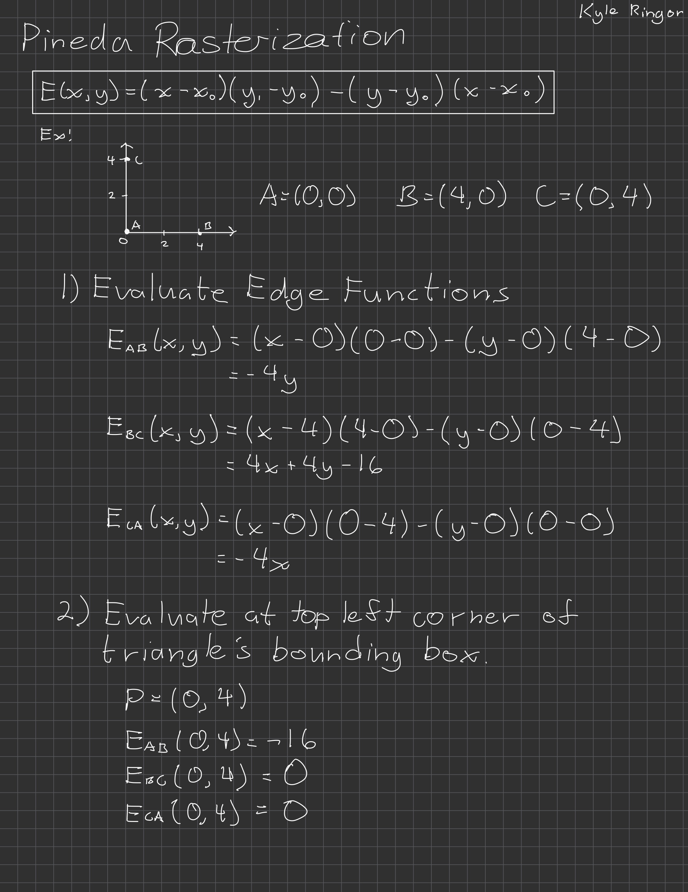
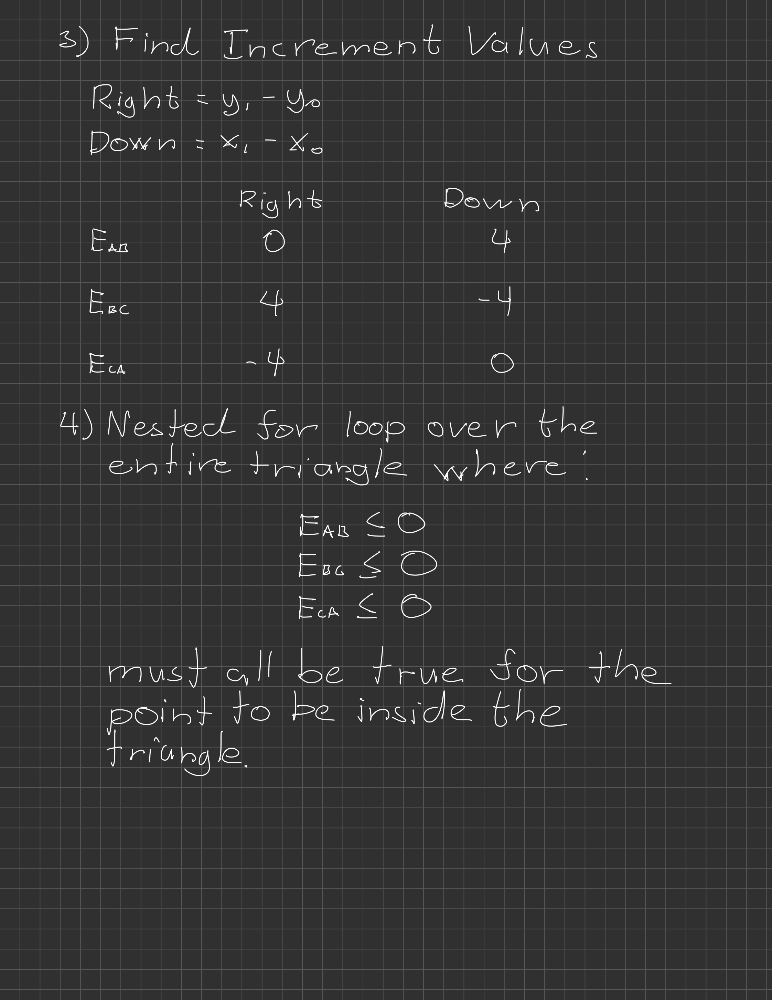

# Rasterization Group Meeting 2

**Date & Time:** 2026-10-13 | 11:30 – 13:00 (PST)  
**Location / Link:** ENGR 370
**Facilitator:** Kyle Ringor
**Note Taker:** Kyle Ringor

---

### Attendees
* **Present:** Kyle Ringor
* **Absent / Excused:** TBD

---

### Agenda & Objectives
1. Pineda rasterization walkthrough and pixel throughput.
2. Geometry, framebuffer, and depth-buffer interfaces.
3. Pseudocode, verification cases, and implementation tasks.

---

### Discussion Points

#### 1. Algorithm Choice

* **Proposal:** Use Pineda bounding-box edge-function rasterization; confirm the
  choice and reasoning with the team.
* Walk through triangle setup, bounding-box bounds, the starting pixel sample,
  edge functions, incremental updates, and the inside-triangle test.
* Define coordinate direction, pixel sample positions, triangle winding, and the
  shared-edge fill rule before implementation.

##### Worked Example: Triangle Setup

* If screen coordinates instead increase y downward, moving down uses
  `E -= (x1-x0)`. The pictured triangle uses `E <= 0` for coverage;
  winding and shared-edge handling still need to be agreed on.

#### 2. Pixel Throughput
* **Context:** Bounding-box traversal tests samples outside the triangle too;
  pixels tested and pixels written are different throughput measures.
* **Open Questions:**
  * How many cycles are needed for triangle setup?
  * Can we test one pixel sample per cycle after setup?
  * How will framebuffer writes and depth-buffer access stall traversal?
  * What render resolution and frame-rate target are we designing for?

#### 3. Surrounding Data Structures
* **Triangle queue from geometry:** Discuss packet contents, buffering, and what
  happens when the rasterizer is busy.
* **Z-buffer, if included:** Define depth format, comparison behavior, memory
  access timing, and who clears it.
* **Framebuffer:** Define pixel coordinates or addresses, color format, write
  signals, memory timing, backpressure, and who clears it. Coordinate with the
  VGA Team through [issue #6](https://github.com/cdi-sjsu/tiny-fixed-function-gpu/issues/6).

#### 4. Geometry's Interface
* **Proposed input fields:** Three vertices with screen coordinates, plus depth
  and color as needed by the selected features.
* **Open Questions:**
  * What are the coordinate widths, signedness, and fixed-point precision?
  * Is RGB provided per triangle for flat color or per vertex for interpolation?
  * Who owns clipping and triangle setup?
  * What are the port widths and ready/valid acceptance rules?
* Align with the Geometry Team's
  [interface issue #4](https://github.com/cdi-sjsu/tiny-fixed-function-gpu/issues/4).

#### 5. Pseudocode and Verification (If we have time)

* Write pseudocode for: accept triangle → setup → traverse bounding box → test
  coverage → optional interpolation/depth test → write pixel → complete.
* Trace the pictured triangle through the pseudocode and identify the registers
  and control states needed for RTL.
* Define what happens during input/output stalls and how reset and triangle/frame
  completion are signaled.
* Verify shared edges, off-screen triangles, degenerate triangles, and stalls;
  add depth-test cases if depth buffering is selected.

---

### Key Decisions Made
* Pending team discussion.

---

### Action Items

| Task | Owner | Due Date | Status |
| :--- | :--- | :--- | :--- |
| Document algorithm choice and coordinate/coverage conventions | TBD | TBD | Proposed |
| Agree on geometry and framebuffer interface tables with the other teams | TBD | TBD | Proposed |
| Draft rasterization pseudocode and verification cases | TBD | TBD | Proposed |

---

### Next Steps & Follow-Up
* **Next Meeting:** YYYY-MM-DD at 00:00
* **Artifacts / Links:**
  * [Meeting 1: Rasterization options](meeting_1.md)
  * [Rasterization algorithms, interfaces, and pseudocode: issue #19](https://github.com/cdi-sjsu/tiny-fixed-function-gpu/issues/19)
